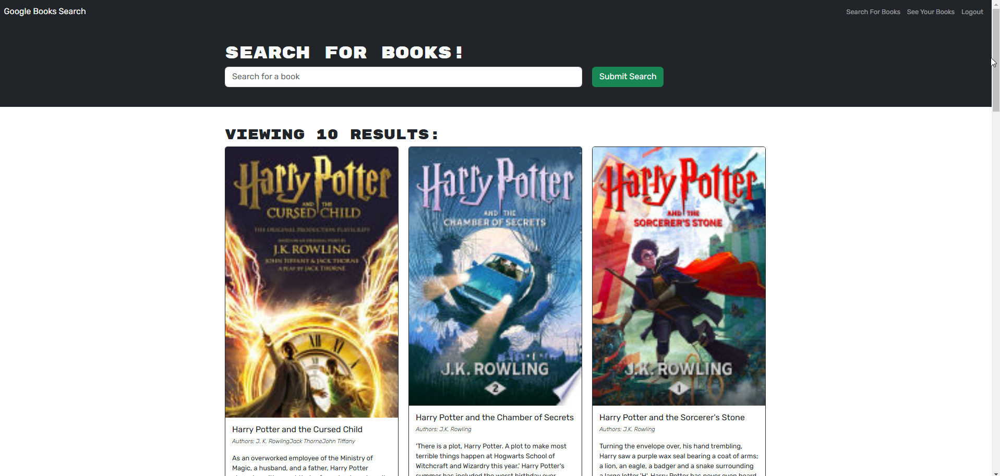
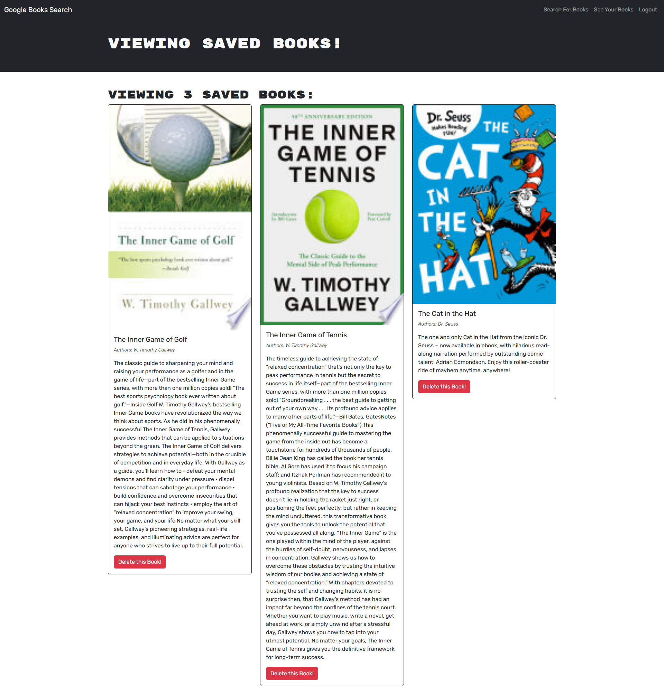

<a name="readme-top"></a>


<!-- PROJECT LOGO -->
<br />
<div align="center">
  <a href="https://github.com/sbanati/Book-Wizard">  
    
  </a>

<h1 align="center">Book|Wizard</h1>

  <p align="center">
    Book Search 
    <br />
    <a href="https://book-wizard.onrender.com"><strong>View Demo</strong></a>
    <br />
    <br />
 

  </p>
</div>


<!-- TABLE OF CONTENTS -->
<details>
  <summary>Table of Contents</summary>
  <ol>
    <li>
      <a href="#about-the-project">About The Project</a>
      <ul>
        <li><a href="#built-with">Built With</a></li>
      </ul>
    </li>
    <li>
      <a href="#getting-started">Getting Started</a>
      <ul>
        <li><a href="#installation">Installation</a></li>
      </ul>
    </li>
    <li><a href="#usage">Usage</a></li>
    <li><a href="#additions">Additions</a></li>
    <li><a href="#contributing">Contributing</a></li>
    <li><a href="#acknowledgement">Acknowledgement</a></li>
    <li><a href="#contact">Contact</a></li>
  </ol>
</details>


<!-- ABOUT THE PROJECT -->
## About The Project

This app was built using the MERN stack, with a React front end, MongoDB database, and Node.js/Express.js server and API. This application was a fully functioning Google Books API search engine built with a RESTful API and was refactored to be a GraphQL API built with Apollo Server 
<br><br>
 


<p align="right">(<a href="#readme-top">back to top</a>)</p>


### Built With


 <br>


  


<p align="right">(<a href="#readme-top">back to top</a>)</p>


<!-- GETTING STARTED -->
## Getting Started

### For end user: <a href="https://book-wizard.onrender.com"><strong>Application live link</strong></a>


### Installation
Clone the repo below and open the project in your source code editor. Open the terminal, navigate to the root directory and execute "npm install" to ensure all required packages are installed. Once this is done, stay in the root directory and run npm run install. This will install the dependencies in both the client and server folders. Lastly initiate the application by running "npm run develop" in the terminal. <br>

1. Clone the repo
   ```sh
   https://github.com/sbanati/Book-Wizard.git
   ```

2. Install npm packages in terminal 
   ```sh
   npm install in root directory
   npm run install (script to install dependencies in client & server
   ```

3. Start Server from the root directory.   
   ```sh
   npm run develop
   ```   

4. Open application on browser
   ```sh
   The application by default will open on http://localhost:3000/ in browser, 
   ```

<p align="right">(<a href="#readme-top">back to top</a>)</p>


<!-- USAGE EXAMPLES -->
## Usage





<p align="right">(<a href="#readme-top">back to top</a>)</p>


<!-- ROADMAP -->
## Additions

<h3>Possible features</h3>

* light/dark mode
* advanced search filters
* PWA
  
  
 

<p align="right">(<a href="#readme-top">back to top</a>)</p>


<!-- CONTRIBUTING -->
## Contributing

This part of the readme is where community involvement can happen! Normally I would have my Github setup to where anyone can fork and push or make an issue, but 
I am still learning that stuff. In the mean time this is how the section would look like. Pretty much from the Template. <br>

Contributions are what make the open source community such an amazing place to learn, inspire, and create. Any contributions you make are **greatly appreciated**.
If you have a suggestion that would make this better, please fork the repo and create a pull request. You can also simply open an issue with the tag "enhancement".


1. Fork the Project
2. Create your Feature Branch (`git checkout -b feature/NewFeature`)
3. Commit your Changes (`git commit -m 'Added some Goated new feature'`)
4. Push to the Branch (`git push origin feature/NewFeature`)
5. Open a Pull Request

<p align="right">(<a href="#readme-top">back to top</a>)</p>


<!-- ACKNOWLEDGEMENT -->
## Acknowledgement
* Sachin
* Pair programmed with Salvatore
* Pair programmed with Jason 
  


<p align="right">(<a href="#readme-top">back to top</a>)</p>


<!-- CONTACT -->
## Contact

Twitter and email - [@twitter_TherealSLVR](https://twitter.com/TherealSLVR) - smbanati@gmail.com

Project Link: https://github.com/sbanati/Sahil.Dev

<p align="right">(<a href="#readme-top">back to top</a>)</p>


References:
* https://github.com/irfaan008/simple-skill-icons?tab=readme-ov-file#icons-list (for badges)
* https://github.com/othneildrew/Best-README-Template 


